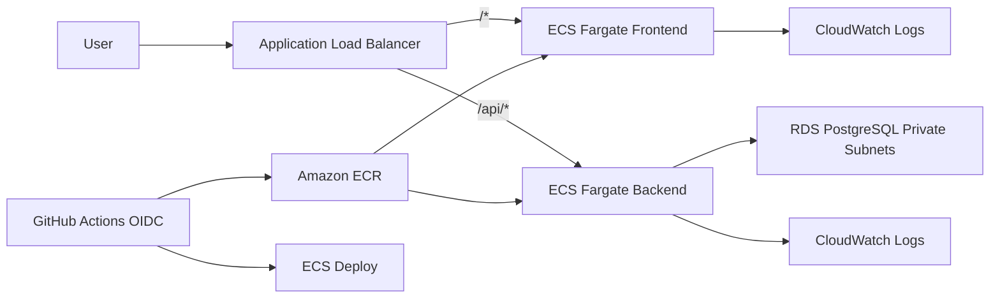

# AWS DevOps Portfolio Project

Production-ready full-stack portfolio project demonstrating Docker, Docker Compose, GitHub Actions, Amazon ECR, Amazon ECS Fargate, Amazon RDS PostgreSQL, CloudWatch, Application Load Balancer, IAM least privilege, Secrets Manager, and Terraform.

## What This Demonstrates

- Full-stack app split into `apps/backend` and `apps/frontend`
- Express API with PostgreSQL, environment validation, request logging, and tests
- Next.js frontend with health status, dashboard, and users workflow
- Local development with Docker Compose, PostgreSQL, and Redis
- Production Docker images for backend and frontend
- AWS infrastructure as code with Terraform modules
- ECR repositories for image storage
- ECS Fargate services behind an ALB
- RDS PostgreSQL in private subnets
- CloudWatch log groups for containers
- GitHub Actions CI and deployment with AWS OIDC
- Secrets Manager for the database connection string

## Architecture Overview



ALB is the only public entry point. ECS tasks run in private subnets. RDS is private and only accepts PostgreSQL traffic from the backend ECS security group.

## Project Structure

```text
/apps
  /backend      Express API, PostgreSQL, tests
  /frontend     Next.js application
/docker
  backend.Dockerfile
  frontend.Dockerfile
/infra
  /terraform
    /modules
      /network
      /ecr
      /ecs
      /rds
      /alb
      /iam
      /cloudwatch
/.github
  /workflows
    ci.yml
    deploy.yml
docker-compose.yml
.env.example
README.md
```

## Local Development

Copy the example environment file if you want to run the apps outside Compose:

```bash
cp .env.example .env
```

Run the full local stack:

```bash
docker compose up --build
```

Local URLs:

- Frontend: `http://localhost:3000`
- Backend health: `http://localhost:4000/health`
- Backend users: `http://localhost:4000/users`
- PostgreSQL: `localhost:5432`
- Redis: `localhost:6379`

Run Node scripts without Docker:

```bash
npm install
npm run lint
npm test
npm run build
npm run dev:backend
npm run dev:frontend
```

## Backend API

Endpoints:

- `GET /health`
- `GET /users`
- `POST /users`
- `GET /api/health`
- `GET /api/users`
- `POST /api/users`

The `/api/*` aliases support ALB listener routing in AWS.

Example request:

```bash
curl -X POST http://localhost:4000/users \
  -H "Content-Type: application/json" \
  -d '{"name":"Ada Lovelace","email":"ada@example.com"}'
```

## Terraform Setup

Prepare variables:

```bash
cd infra/terraform
cp terraform.tfvars.example terraform.tfvars
```

Edit `terraform.tfvars` with your AWS region, GitHub owner, and repository.

Provision infrastructure:

```bash
terraform init
terraform plan
terraform apply
```

Useful outputs:

```bash
terraform output alb_public_url
terraform output backend_ecr_repository_url
terraform output frontend_ecr_repository_url
terraform output ecs_cluster_name
terraform output github_actions_role_arn
```

Important bootstrap note: Terraform creates ECR repositories and ECS services that reference the `latest` image tag. If no image exists yet, ECS tasks can fail until the first GitHub Actions deployment pushes images. After the first successful deploy, services should stabilize.

## AWS Services Created

- VPC, public subnets, private subnets, Internet Gateway, optional NAT Gateway
- Security groups for ALB, frontend ECS, backend ECS, and RDS
- ECR repositories for backend and frontend
- ECS cluster, task definitions, and Fargate services
- Application Load Balancer, target groups, listener, and `/api/*` rule
- RDS PostgreSQL instance and subnet group
- Secrets Manager secret containing database connection details
- CloudWatch log groups
- IAM roles for ECS tasks and optional GitHub Actions OIDC deployment

## GitHub Actions Configuration

Create these GitHub repository variables:

| Name | Example |
| --- | --- |
| `AWS_REGION` | `us-east-1` |
| `AWS_ACCOUNT_ID` | `123456789012` |
| `AWS_DEPLOY_ROLE_ARN` | Terraform output `github_actions_role_arn` |
| `ECS_CLUSTER_NAME` | Terraform output `ecs_cluster_name` |
| `ECS_BACKEND_SERVICE_NAME` | Terraform output `backend_service_name` |
| `ECS_FRONTEND_SERVICE_NAME` | Terraform output `frontend_service_name` |
| `ECR_BACKEND_REPOSITORY` | `devops-portfolio-prod-backend` |
| `ECR_FRONTEND_REPOSITORY` | `devops-portfolio-prod-frontend` |
| `ALB_PUBLIC_URL` | Terraform output `alb_public_url` |

This project uses OIDC through `aws-actions/configure-aws-credentials`. Do not create long-lived AWS access keys for CI/CD.

## CI Workflow

`.github/workflows/ci.yml` runs on pull requests to `main`:

1. Install npm dependencies
2. Run lint
3. Run backend tests
4. Build backend and frontend
5. Build backend Docker image without pushing
6. Build frontend Docker image without pushing

## Deploy Workflow

`.github/workflows/deploy.yml` runs on pushes to `main`:

1. Assumes the AWS deployment role using GitHub OIDC
2. Logs in to Amazon ECR
3. Builds backend and frontend Docker images
4. Tags images with the commit SHA and `latest`
5. Pushes images to ECR
6. Reads current ECS task definitions
7. Replaces container image URIs
8. Registers new task definitions
9. Updates ECS backend and frontend services
10. Waits for ECS service stability
11. Checks the frontend root URL and `/api/health`

## How Images Are Pushed To ECR

The deploy workflow builds images from:

```bash
docker/backend.Dockerfile
docker/frontend.Dockerfile
```

Image names follow:

```text
<aws-account-id>.dkr.ecr.<region>.amazonaws.com/<repository>:<git-sha>
<aws-account-id>.dkr.ecr.<region>.amazonaws.com/<repository>:latest
```

## How ECS Fargate Deploy Works

GitHub Actions does not mutate Terraform files. It reads the active ECS task definition, swaps the image URI for the new ECR tag, registers a new revision, and updates the ECS service to that revision.

Terraform keeps ownership of infrastructure. The ECS service resources ignore task definition drift so Terraform will not undo application deployments.

## CloudWatch Logs

List log groups:

```bash
aws logs describe-log-groups
```

Tail backend logs:

```bash
aws logs tail /ecs/devops-portfolio-prod/backend --follow
```

Tail frontend logs:

```bash
aws logs tail /ecs/devops-portfolio-prod/frontend --follow
```

## Load Balancer Checks

After Terraform:

```bash
terraform output alb_public_url
```

After deployment:

```bash
curl http://<alb-dns-name>/
curl http://<alb-dns-name>/api/health
```

## Required AWS Permissions

The human or automation running Terraform needs permissions to manage:

- EC2 VPC, subnets, route tables, NAT Gateway, EIP, and security groups
- ECR repositories and lifecycle policies
- ECS clusters, services, and task definitions
- Elastic Load Balancing v2 resources
- RDS instances and subnet groups
- Secrets Manager secrets and versions
- CloudWatch log groups
- IAM roles, role policies, policy attachments, and OIDC provider

The GitHub Actions deployment role is limited to:

- Push images to the two ECR repositories
- Describe and register ECS task definitions
- Describe and update the portfolio ECS services
- Pass only the ECS task roles to `ecs-tasks.amazonaws.com`

## Security Notes

- Do not commit `.env` files
- Do not hardcode AWS credentials
- Use GitHub Actions OIDC instead of long-lived access keys
- Keep RDS in private subnets
- Expose only the Application Load Balancer publicly
- Store database credentials in Secrets Manager
- Do not log database credentials
- Keep ECS task roles scoped to required actions

## Common AWS Commands

```bash
aws ecs list-clusters
aws ecs list-services --cluster <cluster-name>
aws ecs describe-services --cluster <cluster-name> --services <service-name>
aws logs describe-log-groups
aws ecr describe-repositories
```

Check service events:

```bash
aws ecs describe-services \
  --cluster <cluster-name> \
  --services <service-name> \
  --query 'services[0].events[0:10]'
```

Check target health:

```bash
aws elbv2 describe-target-health --target-group-arn <target-group-arn>
```

## Destroy Infrastructure Safely

Destroy the environment:

```bash
cd infra/terraform
terraform destroy
```

If RDS deletion protection is enabled, set this first:

```hcl
db_deletion_protection = false
```

Then run:

```bash
terraform apply
terraform destroy
```

For production-like environments, set `skip_final_snapshot = false` before destroying RDS.

## Estimated AWS Services Used

This project can create billable resources:

- NAT Gateway
- Application Load Balancer
- ECS Fargate tasks
- RDS PostgreSQL
- ECR image storage
- CloudWatch log storage
- Secrets Manager secret

For cost control in a portfolio account, destroy the stack when you are done testing.

## Suggested Next Improvements

- Add HTTPS with ACM
- Add Route 53 domain
- Add Redis with ElastiCache
- Add Kubernetes version with EKS
- Add Helm chart
- Add Argo CD
- Add Prometheus/Grafana
- Add security scan with Trivy
- Add blue/green deploy
